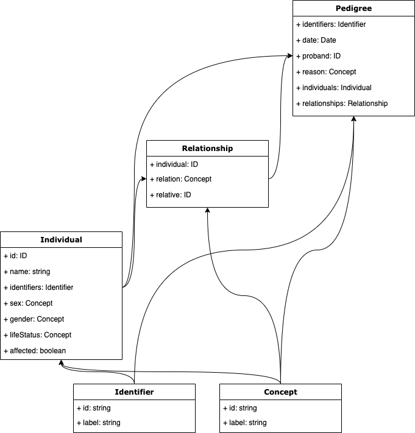

#######
Classes
#######

The diagram below shows an overview of the pedigree classes. Lines between classes indicate composition.

Individual
==========

The subject of a **Pedigree** is represented by an **Individual** class. This class intends to represent an individual person or patient who is a member of the pedigree being investigated.  

.. list-table::
   :header-rows: 1

   * - Field
     - Type
     - Multiplicity
     - Description
   * - id
     - ID
     - 1..1
     - Logical ID
   * - name
     - string
     - 0..1
     - Name of the individual
   * - identifiers
     - array of ``Identifier``
     - 0..*
     - External identifiers for the individual
   * - sex
     - ``Concept``
     - 1..1
     - Sex assigned at birth, values: ``male``, ``female``, ``other``, ``unknown``; See `Gender Harmony Context Definitions <https://confluence.hl7.org/display/VOC/Gender+Harmony+Context+Definitions>`_ and `FHIR AdministrativeGender Value Set <http://hl7.org/fhir/ValueSet/administrative-gender>`_.
   * - gender
     - ``Concept``
     - 0..1
     - Presumed or reported gender identity, values: ``male``, ``female``, ``non-binary``, ``non-disclosed``, ``trans``, etc.; See `Gender Harmony Context Definitions <https://confluence.hl7.org/display/VOC/Gender+Harmony+Context+Definitions>`_.
   * - lifeStatus
     - ``Concept``
     - 0..1
     - The presumed/accepted life status of the individual as of the pedigree collection date, values: ``alive``, ``deceased``, ``unborn``
   * - affected
     - boolean
     - 0..1
     - Whether or not the individual is affected by the condition being investigated in this pedigree (``Pedigree.reason``)

Relationship
============

The *Relationship* class defines the family relations in a pedigree.

.. list-table::
   :header-rows: 1

   * - Field
     - Type
     - Multiplicity
     - Description
   * - individual
     - ID
     - 1..1
     - Identifier of the subject ``Individual``; equivalent to the Biolink "subject" and similar to the FHIR "Player"
   * - relation
     - ``Concept``
     - 1..1
     - The relationship the ``individual`` has to the ``relative`` (*e.g.*, if the ``individual`` is the ``relative``'s biological mother, then relation could be ``isBiologicalMotherOf`` ``[KIN:027]``); terms should come from the `KIN Ontology <http://purl.org/ga4gh/kin.owl>`_.
   * - relative
     - ID
     - 1..1
     - Identifier of the relative ``Individual``; equivalent to the Biolink "object" and similar to the FHIR "Scoping Individual"

Pedigree
========

A clinical **Pedigree** is curated selection of information about a family, including the individuals, relationships between them, and relevant health conditions.

.. list-table::
   :header-rows: 1

   * - Field
     - Type
     - Multiplicity
     - Description
   * - identifiers
     - array of ``Identifier``
     - 0..*
     - External identifiers for the family
   * - date
     - Date
     - 0..1
     - The date the pedigree was collected or last updated, as ISO full or partial date, *i.e.* ``YYYY``, ``YYYY-MM``, or ``YYYY-MM-DD``
   * - proband
     - ID
     - 0..1
     - ID of ``Individual`` that is the index case for the family, usually the first person referred to genetics or tested for the condition being investigated
   * - reason
     - ``Concept``
     - 0..1
     - The reason for pedigree collection, especially a health condition of focus being investigated in the family; if any ``Individual`` has the ``affected`` property defined, it refers to this condition.
   * - individuals
     - array of ``Individual``
     - 0..*
     - Collection of the individuals who are the members of this pedigree
   * - relationships
     - array of ``Relationship``
     - 0..*
     - Collection of relationships between the individuals who are the members of this pedigree

Identifier
==========

This is an identifier for the individual in another system.

.. list-table::
   :header-rows: 1

   * - Field
     - Type
     - Multiplicity
     - Description
   * - id
     - string
     - 1..1
     - An external identifier such as a medical record number, participant ID, or insurance number; URI/CURIE is preferred.
   * - label
     - string
     - 0..1
     - A human-readable label for the identifier

Concept
=======

This is a reference to a concept in an ontology/terminology/valueset.

.. list-table::
   :header-rows: 1

   * - Field
     - Type
     - Multiplicity
     - Description
   * - id
     - string
     - 1..1
     - A CURIE associated with the concept (*e.g.*, ``HP:0000118``)
   * - label
     - string
     - 0..1
     - A human-readable label for the concept (*e.g.*, ``"Phenotypic abnormality"``)
