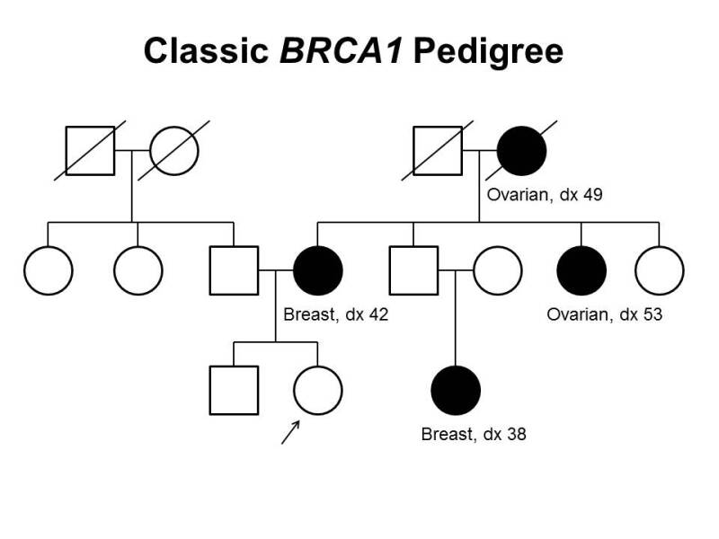

########
Examples
########

.. toctree::
   :maxdepth: 1

Examples
===========

The following examples demonstrate the way in which pedigrees of various complexity can be represented using the pedigree conceptual model.

Any pedigree more complex than would be represented with a PED file should use the conceptual model implemented within a compatible standard, such as FHIR or Phenopacket.

Basic Trio
------------

A basic family trio consists of one male parent, one female parent, and a proband child. This would be represented as a Pedigree with three Individuals and two parent-child Relationships:

.. code-block:: yaml

  id: FAM1
  narrative: A GA4GH Pedigree of a trio with an affected child
  date: 2022-06-23
  individuals:
    - id: MOTHER
      sex_assigned_at_birth: assigned female
    - id: FATHER
      sex_assigned_at_birth: assigned male
    - id: CHILD
      egg_parent: MOTHER
      sperm_parent: FATHER
  relationships:
    - individual: MOTHER
      relative: CHILD
      biological_relationship:
        - id: KIN:027
          label: isBiologicalMotherOf
    - individual: FATHER
      relative: CHILD
      biological_relationship:
        - id: KIN:028
          label: isBiologicalFatherOf
  index_patients:
    - CHILD

Twins
----------

The relationship between twins (TWIN1 and TWIN2) can be represented by adding another Individual, parent-child relationships and a twin Relationship to the Pedigree:

.. code-block:: yaml

  id: FAM2
  narrative: A GA4GH Pedigree of a couple with identical twins
  date: 2022-06-23
  individuals:
    - id: MOTHER
      sex_assigned_at_birth: assigned female
    - id: FATHER
      sex_assigned_at_birth: assigned male
    - id: TWIN1
      egg_parent: MOTHER
      sperm_parent: FATHER
    - id: TWIN2
      egg_parent: MOTHER
      sperm_parent: FATHER
  relationships:
    - individual: MOTHER
      relative: TWIN1
      biological_relationship:
        - id: KIN:027
          label: isBiologicalMotherOf
    - individual: FATHER
      relative: TWIN1
      biological_relationship:
        - id: KIN:028
          label: isBiologicalFatherOf
    - individual: TWIN1
      relative: TWIN2
      twin_group:
        - monozygotic

The parent-child relationships for TWIN2 are not strictly necessary.
Because the ``isMonozygoticMultipleBirthSiblingOf`` relationship is symmetric, it would be equally valid to have said that TWIN2 is the ``individual`` and TWIN1 the ``relative``.

Adoption
----------

.. code-block:: yaml

  id: FAM3
  narrative: A GA4GH Pedigree of a child with an adoptive mother
  date: 2022-06-23
  individuals:
    - id: ADOPTIVE_MOTHER
      sex_assigned_at_birth: assigned female
    - id: BIOLOGICAL_MOTHER
      sex_assigned_at_birth: assigned female
    - id: FATHER
      sex_assigned_at_birth: assigned male
    - id: CHILD
      egg_parent: BIOLOGICAL_MOTHER
      sperm_parent: FATHER
  relationships:
    - individual: ADOPTIVE_MOTHER
      relative: CHILD
      social_relationship:
        - id: KIN:022
          label: isAdoptiveParentOf
    - individual: BIOLOGICAL_MOTHER
      relative: CHILD
      biological_relationship:
        - id: KIN:027
          label: isBiologicalMotherOf
    - individual: FATHER
      relative: CHILD
      biological_relationship:
        - id: KIN:028
          label: isBiologicalFatherOf

IVF
-----

.. code-block:: yaml

  id: FAM4
  narrative: A GA4GH Pedigree of a child with an egg donor, gestational carrier, and biological father
  date: 2022-06-23
  individuals:
    - id: EGG_DONOR
      sex_assigned_at_birth: assigned female
    - id: SURROGATE
      sex_assigned_at_birth: assigned female
    - id: FATHER
      sex_assigned_at_birth: assigned male
    - id: CHILD
      egg_parent: EGG_DONOR
      sperm_parent: FATHER
  relationships:
    - individual: EGG_DONOR
      relative: CHILD
      biological_relationship:
        - id: KIN:038
          label: isOvumDonorOf
    - individual: SURROGATE
      relative: CHILD
      biological_relationship:
        - id: KIN:005
          label: isGestationalCarrierOf
    - individual: FATHER
      relative: CHILD
      biological_relationship:
        - id: KIN:028
          label: isBiologicalFatherOf

Consanguinity
--------------

A pedigree where the parents are first cousins can flag the consanguineous relationship:

.. code-block:: yaml

  id: FAM6
  narrative: A GA4GH Pedigree with consanguineous parents
  date: 2022-06-23
  individuals:
    - id: PARENT_A
    - id: PARENT_B
    - id: CHILD
      egg_parent: PARENT_A
      sperm_parent: PARENT_B
  relationships:
    - individual: PARENT_A
      relative: CHILD
      biological_relationship:
        - id: KIN:027
          label: isBiologicalMotherOf
    - individual: PARENT_B
      relative: CHILD
      biological_relationship:
        - id: KIN:028
          label: isBiologicalFatherOf
    - individual: PARENT_A
      relative: PARENT_B
      consanguinity: true
      consanguinity_note: First cousins

Complete cancer family
---------------------------

   Example BRCA1 pedigree. Source: https://visualsonline.cancer.gov/details.cfm?imageid=10436

.. code-block:: yaml

  id: FAM5
  narrative: A GA4GH Pedigree of a classic BRCA1 pedigree
  date: 2022-06-23
  individuals:
    - id: "1"
      sex_assigned_at_birth: assigned male
      deceased: true
    - id: "2"
      sex_assigned_at_birth: assigned female
      deceased: true
    - id: "3"
      sex_assigned_at_birth: assigned male
      deceased: true
    - id: "4"
      sex_assigned_at_birth: assigned female
      deceased: true
    - id: "5"
      sex_assigned_at_birth: assigned female
      egg_parent: "2"
      sperm_parent: "1"
    - id: "6"
      sex_assigned_at_birth: assigned female
      egg_parent: "2"
      sperm_parent: "1"
    - id: "7"
      sex_assigned_at_birth: assigned male
      egg_parent: "2"
      sperm_parent: "1"
    - id: "8"
      sex_assigned_at_birth: assigned female
      egg_parent: "4"
      sperm_parent: "3"
    - id: "9"
      sex_assigned_at_birth: assigned male
      egg_parent: "4"
      sperm_parent: "3"
    - id: "10"
      sex_assigned_at_birth: assigned female
    - id: "11"
      sex_assigned_at_birth: assigned female
      egg_parent: "4"
      sperm_parent: "3"
    - id: "12"
      sex_assigned_at_birth: assigned female
      egg_parent: "4"
      sperm_parent: "3"
    - id: "13"
      sex_assigned_at_birth: assigned male
    - id: "14"
      sex_assigned_at_birth: assigned female
    - id: "15"
      sex_assigned_at_birth: assigned female
  relationships:
    - individual: "1"
      relative: "5"
      biological_relationship:
        - id: KIN:028
          label: isBiologicalFatherOf
    - individual: "2"
      relative: "5"
      biological_relationship:
        - id: KIN:027
          label: isBiologicalMotherOf
    - individual: "1"
      relative: "6"
      biological_relationship:
        - id: KIN:028
          label: isBiologicalFatherOf
    - individual: "2"
      relative: "6"
      biological_relationship:
        - id: KIN:027
          label: isBiologicalMotherOf
    - individual: "1"
      relative: "7"
      biological_relationship:
        - id: KIN:028
          label: isBiologicalFatherOf
    - individual: "2"
      relative: "7"
      biological_relationship:
        - id: KIN:027
          label: isBiologicalMotherOf
    - individual: "3"
      relative: "8"
      biological_relationship:
        - id: KIN:028
          label: isBiologicalFatherOf
    - individual: "4"
      relative: "8"
      biological_relationship:
        - id: KIN:027
          label: isBiologicalMotherOf
    - individual: "3"
      relative: "9"
      biological_relationship:
        - id: KIN:028
          label: isBiologicalFatherOf
    - individual: "4"
      relative: "9"
      biological_relationship:
        - id: KIN:027
          label: isBiologicalMotherOf
    - individual: "3"
      relative: "11"
      biological_relationship:
        - id: KIN:028
          label: isBiologicalFatherOf
    - individual: "4"
      relative: "11"
      biological_relationship:
        - id: KIN:027
          label: isBiologicalMotherOf
    - individual: "3"
      relative: "12"
      biological_relationship:
        - id: KIN:028
          label: isBiologicalFatherOf
    - individual: "4"
      relative: "12"
      biological_relationship:
        - id: KIN:027
          label: isBiologicalMotherOf
    - individual: "7"
      relative: "13"
      biological_relationship:
        - id: KIN:028
          label: isBiologicalFatherOf
    - individual: "8"
      relative: "13"
      biological_relationship:
        - id: KIN:027
          label: isBiologicalMotherOf
    - individual: "9"
      relative: "14"
      biological_relationship:
        - id: KIN:028
          label: isBiologicalFatherOf
    - individual: "10"
      relative: "14"
      biological_relationship:
        - id: KIN:027
          label: isBiologicalMotherOf
    - individual: "7"
      relative: "15"
      biological_relationship:
        - id: KIN:028
          label: isBiologicalFatherOf
    - individual: "8"
      relative: "15"
      biological_relationship:
        - id: KIN:027
          label: isBiologicalMotherOf
  index_patients:
    - "14"
