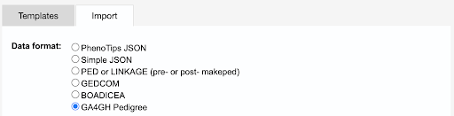
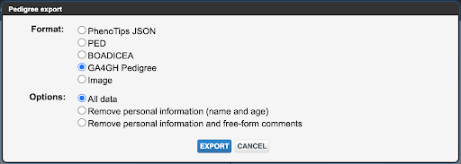

################################################
Implementations
################################################

.. toctree::
   :maxdepth: 1

Known Implementations
========================

The following systems have implemented the GA4GH Pedigree Standard:

FHIR implementations:
----------------------
| `CSIRO Redcap Pedigree Plugin <https://github.com/aehrc/redcap_pedigree_editor>`_ (Open Source) 
| `Open Pedigree <https://github.com/phenotips/open-pedigree>`_ (Open Source)  
|  
The REDCap Pedigree editor External Module is a third party add on to REDCap, a web-based application for building and managing online surveys. The external module allows a field on a survey to be marked as a 'pedigree diagram'. Clicking the field will open a new web browser to the open pedigree web-based pedigree editor, where the pedigree diagram can be entered. The resulting diagram will then be placed into the survey in REDCap as a JSON string using the GA4GH FHIR IG format.

**Kids First Data Resource Center (currently in testing)**

The GA4GH Pedigree model was test-implemented with one of the research studies registered in and publicized by Kids First DRC (hereinafter “KFDRC”). This implementation was done in KFDRC’s development environment based on the GA4GH Pedigree FHIR Implementation Guide and demonstrated at the GA4GH December 2021 Connect. The research study chosen for this use case is titled “GMKF: Kids First Pediatric Research Program on Congenital Cranial Dysinnervation Disorders and Related Birth Defects” (dbGaP Study Accession: phs001247.v1.p1). This implementation has the following FHIR resources:

+----------------------+------------------+----------------+--------------+
| FHIR Resource Type   | Pedigree Profile | # of Resources |     Note     |
+======================+==================+================+==============+
|      Patient         |    Individual    |       899      | 270 probands |
+----------------------+------------------+----------------+--------------+
| FamilyMemberHistory  |   Relationship   |       772      | 27 KIN codes |
+----------------------+------------------+----------------+--------------+
|       Condition      |        --        |       359      |  5 diseases  |
+----------------------+------------------+----------------+--------------+
|      Composition     |     Pedigree     |       270      |  23 families |
|                      |                  |                |  with more   | 
|                      |                  |                |  than  trios |
+----------------------+------------------+----------------+--------------+

The figure below shows one example of pedigree (KF Family ID: FM_C0YWP4XR) that has 8 family members (the indexing proband’s ID: 5047) and the phenotypic abnormality being investigated is with CFP (Complement Factor Properdin). Between Individual resources, 12 Relationship resources were created. The left part of the figure represents this family’s pedigree chart while the right part shows a Relationship resource between Individual 5047 (the indexing patient) and Individual 5037, who is a parental sibling (i.e. a paternal aunt) of 5047.

+---------------------------------------------------+---------------------------------------------------+
| .. figure:: images/KFDRC_implementation_img_1.png | .. figure:: images/KFDRC_implementation_img_2.png |
+---------------------------------------------------+---------------------------------------------------+   
*Figure:* KFDRC Pedigree FHIR IG Implementation Example showing the family's pedigree chart and the associated relationship resource.

Phenopacket implementations:
-----------------------------

**PhenoTips (not yet fully implemented)**

PhenoTips is a commercial clinical software platform which includes a comprehensive pedigree editor.
https://phenotips.com/. PhenoTips supports importing and export family records in the Phenopacket format through the user interface and REST APIs. This capability now includes the GA4GH Pedigree representation within the Family object. The PhenoTips pedigree editor user interface supports importing and exporting pedigrees in the GA4GH Pedigree format. This supports a direct JSON implementation of the core pedigree structure.

*Figure:* PhenoTips Implementation Example showing the import and export format options.

``Do you have an implementation to share? Make a pull request via GitHub to add it.``

