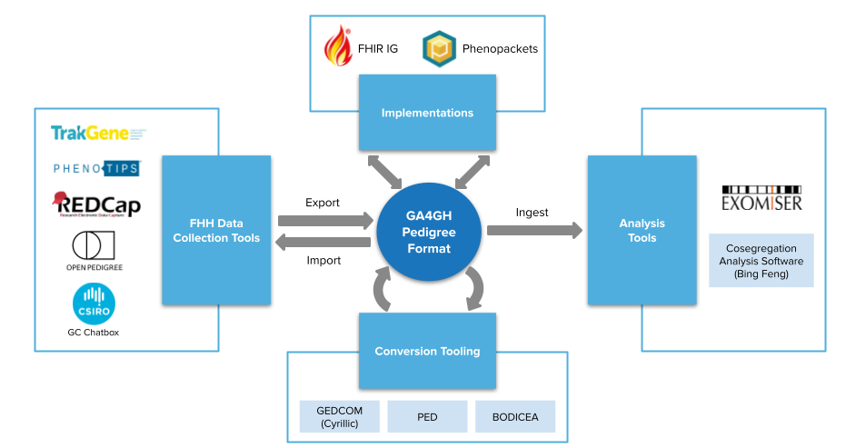

###########################################
Introduction
###########################################

.. toctree::
   :maxdepth: 1

The GA4GH Pedigree Standard
======

.. _reference 1:

The GA4GH Pedigree Standard supports the computable exchange of family structure and relationships for family health history and pedigree use cases. It does this by providing a common conceptual model, implementation guides in common standards, and tooling to support the adoption within existing pipelines. Relationships between individuals are codified using the Kinship Ontology to allow for inference, semantic interoperability, and reasoning.

The primary goal of the GA4GH Pedigree Standard is to support the computable exchange of familial health information between the following healthcare settings:
  - self-reported by patients in portals and intake forms
  - collected by nurses and genetic counselors from patients
  - visualized as a pedigree for clinicians, counselors, and specialists
  - used for sample relationships in genomic data analysis
  - used by risk algorithms, e.g. hereditary cancer predisposition

Because the standardization of detailed clinical and genetic data is well-supported by other formats and efforts, the GA4GH Pedigree standard focuses on improving the core representation of individuals and their relationships in the context of a family. Additional clinical and genetic data associated with individuals in the family are expected to be represented in other standards and linked to individuals within the pedigree representation.

Key terminology
======

**Family health histories** are records of the health conditions in a person's family, usually from a single historian (usually the patient or their caregiver). They are routinely collected as part of health care and stored in the patient's medical record.

**A pedigree** is a standardized representation of the individuals, relationships, and health conditions in a family. This is usually drawn or visualized using standardized symbols (such as circles for women, squares for men, and diamonds for non-binary individuals). This information often comes from the family health histories reported by family members, but is usually curated by the clinical team. In clinical genetics, information from multiple family members is frequently combined to form a single pedigree which is stored in a family record that is separate from any individual's medical record.

Motivation
======

The need for high quality, unambiguous, computable pedigree and family information is critical for scaling genomic analysis to larger, complex families.

Pedigree data is currently represented in heterogeneous formats that frequently result in the use of lowest-common-denominator formats (e.g., PED) or custom JSON formats for data transfer. The HL7 FHIR standard core data models do not support pedigrees, but there is a draft extension to support genomic pedigrees for a single, fixed proband patient.

By standardizing the way systems represent family structure, patients will be able to share this information more easily between healthcare systems, and software tools will be better able to use this information to improve genome analysis and diagnosis.

We asked our stakeholders about their use of family health history and pedigree data - How are you using it? How is it stored? What do you wish you could do with your data that you currently can't? The results of the survey can be `found here <https://docs.google.com/presentation/d/17r-WyVEpl57i0wxnJcgTkmuWclQovMRKkgqJrkWC4Yo/edit?usp=sharing>`_. A significant percentage of respondents were using a non-computable or non-interoperable format, and there was no common tool or format with which they intended to import or export data. Importantly, 57% of respondents were experiencing challenges with standardization, including lack of computability and integration with analysis tools, and inability to represent complex families and share data easily.

A full listing of the use cases that informed development can be `reviewed here <https://docs.google.com/document/d/1i__95wmm3EpVytRD2gngFAXPhUajK2knWOtuHT9r8W8/edit?usp=sharing>`_.

Existing Standards
======

Pedigree
########

The `PED format <https://zzz.bwh.harvard.edu/plink/data.shtml>`_ is a simple text file with 6 columns - IDs, a binary sex field, the phenotype (singular) and SNP genotypes. It can represent parent-child relationships only. It is unable to communicate twins, adoption or donors, pregnancy, vital status, multiple phenotypes and data provenance. All of this type of data is important for genetic counseling and risk assessments where richer representations of relationships are valuable.

Family History
########

The HL7 `FamilyMemberHistory resource <https://www.hl7.org/fhir/familymemberhistory.html>`_ and `FamilyMemberHistory-genetic profile <https://build.fhir.org/familymemberhistory-genetic.html>`_ allow for capturing a proband's family health history. All data and relationships are relative to that single proband and are in the context of a single patient. This limits its use to representing the family history of a single individual rather than the complete pedigree for a family.

The `HL7 FHIR FamilyMember ValueSet <https://terminology.hl7.org/3.1.0/ValueSet-v3-FamilyMember.html>`_ is a taxonomy, not an ontology, which limits its utility for computation and reasoning. It is also Anglo-centric in its construction, which limits the global adoption, for example, there aren't equivalent terms for "aunt" and "uncle". By creating the Kinship Ontology, we were able to define deeper semantics between relationships, allowing these terms to be used for inference or validation.

The Common Dataset for Family Health History
======

The collection and use of family health histories span medical activities from genetic research to heritable risk assessment in patient care. For all the stakeholders in this process, the goal must be data that is accurate and coded for effective analysis, and transferable between systems. To achieve this, a globally accepted and universally implemented family health history (FHH) data set should be established as a benchmark. The purpose of the common dataset document is to create an updated recommended data set that can be used not only in both research and clinical settings, but to eliminate the gap between the two disciplines. This recommendation should also guide the development of research, clinical, and patient-facing FHH data and information collection tools, applications, and data repositories. This document should only be used as informative.

`Common Dataset Document <https://docs.google.com/document/d/1GQRd5jeZeB5qhHclLZxDe6kPD173bXWGYlTsmCbTeuI/edit?usp=sharing>`_

This work was inspired by the efforts of the Personalized Health Care Workgroup of the American Health Information Community, which first released its recommendation on a core family health history (FHH) minimum data set on October 25, 2007. A `peer-reviewed paper <https://www.ncbi.nlm.nih.gov/pmc/articles/PMC2585527/>`_ was published in December 2008.

Example Use Cases
======

The overarching use case is to enable the exchange of information collected through family health histories and clinical genetics pedigrees across pedigree tools and algorithms that operate on pedigrees and family health histories.

Specific use cases considered in the development of the standard include:

   * Representing relationships necessary for counseling (e.g., adoption), risk assessment (e.g., infertility, miscarriage, health history), and assisted reproduction (e.g., IVF, MRT)

   * Allowing the exchange of pedigree information required to inform clinical and research genomic data analysis, noting that the majority of testing involves singletons, <5% as trios, and other family configurations are extremely rare (parent/child duo, sib pair, half-sib pair, quad)

   * Allowing sharing collected clinical and family health history information with bioinformatics systems and research environments (or other services) to unambiguously document relationships between sequenced individuals to support joint calling of variants and filtering of variants based on segregation, as well as describing wider family history (re: non-sequenced individuals).

   * Allowing the exchange of the necessary family health history, genotype, and phenotype results of a patient or relative to computational tools for assessing whether the patient needs further testing or sequence analysis, and/or if a relative needs the same

   * Representing family history and pedigree data in a programmatic standard that people can consume across a number of resources in both a format for analysis as well as for building algorithms and tools over would be of high utility for secondary analysis and research purposes

Requirement Levels
======

The Pedigree model uses two requirement levels. 

Required
########

If a field is required, its presence is  an absolute requirement of the specification, failing which the entire
model is regarded as malformed. This corresponds to the key words ``MUST``, ``REQUIRED``, and ``SHALL`` in
`RFC2119 <https://www.ietf.org/rfc/rfc2119.txt>`_.

Optional
########

A field is truly optional. This category can be applied to fields that are only useful for a certain type of data. For
instance, the Proband ID and Type field is only required when the pedigree is used to focus on heritable risk for a specific person in the pedigree. For other use cases such as research, a Proband type may be needed.

