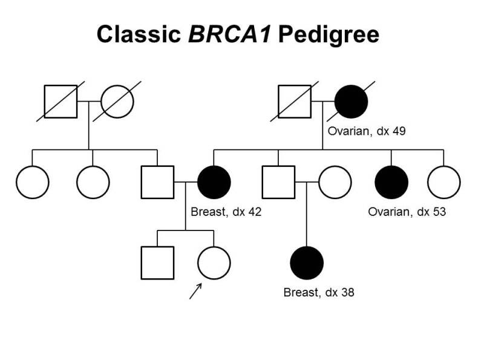

########################
Pedigree Model
########################

.. toctree::
   :maxdepth: 1

Overview
========

To support the interoperability of family health history data within and between existing standards (such as HL7 FHIR and Phenopackets), the GA4GH Clinical and PhenoTips Data Capture Workstream developed the Pedigree Conceptual Model.

The Pedigree Conceptual Model defines core concepts and their properties, and is based on `A Recommendation for The Common Data Set for Family Health History <https://docs.google.com/document/d/1GQRd5jeZeB5qhHclLZxDe6kPD173bXWGYlTsmCbTeuI/edit>`_.

Direction of Relationships
==========================

A Relationship defines a relationship between one individual and another, such as `isBiologicalMotherOf` or `isTwinOf`. Only one of the two directions needs to be specified, and it does not matter which.

Symmetric relationships are those where both individuals share the same relationship with one another. These include: `isTwinOf` and `isPartnerOf`.

Non-symmetric relationships are those where the relationship that individual X has to individual Y is not the same as the relationship that individual Y has to individual X. For example, if individual X has relationship `isBiologicalParentOf` to individual Y, then individual Y has relationship `isBiologicalChildOf` individual X.

Because of this inherent flexibility in the way that relationships can be described, there is no single representation for a particular pedigree. However, pedigrees can be represented in a **reduced form**, in which implied relationships are excluded. A pedigree in reduced form:

1. Has explicit parent-child relationships between all parents and their offspring, and they are directed downwards, with the parent as the individual and the child as the relative.
2. Has sibling relationships only when this is not implied by having shared parents, and in the event of multiple siblings, all sibling relationships are defined relative to the same individual
3. Defines all twin relationships relative to the same individual
4. Has partnership relationships only when this is not implied by having shared children
5. Has extended relative relationships only when this is not implied by the previously-defined relationships, and they are directed downwards, with the ancestor as the individual and the descendant as the relative

Examples
===========

The following examples demonstrate the way in which pedigrees of various complexity can be represented using the pedigree model.

The precise representation within the context of one of the standards, such as FHIR or Phenopacket.

Basic Trio
------------

A basic family trio consists of one male parent, one female parent, and a proband child. This would be represented as a Pedigree with three Individuals and two parent-child Relationships:

As a Phenopacket `GA4GHPedigree` message:

.. code-block:: yaml

  id: FAM1
  narrative: A Phenopacket GA4GHPedigree of a trio with an affected child
  date: 2022-06-23
  individuals:
    - id: 1
      subject:
        id: MOTHER
        sex: FEMALE
    - id: 2
      subject:
        id: FATHER
        sex: MALE
    - id: 3
      subject:
        id: CHILD
        sex: UNKNOWN
  relationships:
    - individual_id: MOTHER
      relation:
        id: KIN:027
        label: isBiologicalMotherOf
      relative_id: CHILD
    - individual_id: FATHER
      relation:
        id: KIN:028
        label: isBiologicalFatherOf
      relative_id: CHILD
  index_patients:
    - CHILD

Twins
----------

The relationship between twins (TWIN1 and TWIN2) can be represented by adding another Individual, parent-child relationships and a twin Relationship to the Pedigree:

.. code-block:: yaml

  id: FAM2
  narrative: A Phenopacket GA4GHPedigree of a couple with identical twins
  date: 2022-06-23
  individuals:
    - id: 1
      subject:
        id: MOTHER
        sex: FEMALE
    - id: 2
      subject:
        id: FATHER
        sex: MALE
    - id: 3
      subject:
        id: TWIN1
        sex: UNKNOWN
    - id: 4
      subject:
        id: TWIN2
        sex: UNKNOWN
  relationships:
    - individual_id: MOTHER
      relation:
        id: KIN:027
        label: isBiologicalMotherOf
      relative_id: TWIN1
    - individual_id: FATHER
      relation:
        id: KIN:028
        label: isBiologicalFatherOf
      relative_id: TWIN1
    - individual_id: TWIN1
      relation:
        id: KIN:010
        label: isMonozygoticMultipleBirthSiblingOf
      relative_id: TWIN2

The parent-child relationships for TWIN2 are not strictly necessary.
Because the `isMonozygoticTwinOf` relationship is symmetric, it would be equally valid to have said that TWIN2 isMonozygoticTwinOf TWIN1.

Adoption
----------

.. code-block:: yaml

  id: FAM3
  narrative: A Phenopacket GA4GHPedigree of a child with an adoptive mother
  date: 2022-06-23
  individuals:
    - id: 1
      subject:
        id: MOTHER
        sex: FEMALE
    - id: 2
      subject:
        id: BIOLOGICAL_MOTHER
        sex: FEMALE
    - id: 3
      subject:
        id: FATHER
        sex: MALE
    - id: 4
      subject:
        id: CHILD
        sex: UNKNOWN
  relationships:
    - individual_id: MOTHER
      relation:
        id: KIN:022
        label: isAdoptiveParentOf
      relative_id: CHILD
    - individual_id: BIOLOGICAL_MOTHER
      relation:
        id: KIN:027
        label: isBiologicalMotherOf
      relative_id: CHILD
    - individual_id: FATHER
      relation:
        id: KIN:028
        label: isBiologicalFatherOf
      relative_id: CHILD

IVF
-----

.. code-block:: yaml

  id: FAM4
  narrative: A Phenopacket GA4GHPedigree of a child with an egg donor, gestational carrier, and biological father
  date: 2022-06-23
  individuals:
    - id: 1
      subject:
        id: MOTHER
        sex: FEMALE
    - id: 2
      subject:
        id: SURROGATE
        sex: FEMALE
    - id: 3
      subject:
        id: FATHER
        sex: MALE
    - id: 4
      subject:
        id: CHILD
        sex: UNKNOWN
  relationships:
    - individual_id: MOTHER
      relation:
        id: KIN:038
        label: isOvumDonorOf
      relative_id: CHILD
    - individual_id: SURROGATE
      relation:
        id: KIN:005
        label: isGestationalCarrierOf
      relative_id: CHILD
    - individual_id: FATHER
      relation:
        id: KIN:028
        label: isBiologicalFatherOf
      relative_id: CHILD

Complete cancer family
---------------------------

   Example BRCA1 pedigree. Source: https://visualsonline.cancer.gov/details.cfm?imageid=10436

.. code-block:: yaml

  id: FAM5
  narrative: A Phenopacket GA4GHPedigree of a classic BRCA1 pedigree
  date: 2022-06-23
  individuals:
    - id: 1
      subject:
        id: 1
        sex: MALE
        vital_status: DECEASED
    - id: 2
      subject:
        id: 2
        sex: FEMALE
        vital_status: DECEASED
    - id: 3
      subject:
        id: 3
        sex: MALE
        vital_status: DECEASED
    - id: 4
      subject:
        id: 4
        sex: FEMALE
        vital_status: DECEASED
        diseases:
          - term:
              id:
              label: Ovarian cancer
            onset:
              age: P49Y
    - id: 5
      subject:
        id: 5
        sex: FEMALE
    - id: 6
      subject:
        id: 6
        sex: FEMALE
    - id: 7
      subject:
        id: 7
        sex: MALE
    - id: 8
      subject:
        id: 8
        sex: FEMALE
        diseases:
          - term:
              id:
              label: Breast cancer
            onset:
              age: P42Y
    - id: 9
      subject:
        id: 9
        sex: MALE
    - id: 10
      subject:
        id: 10
        sex: FEMALE
    - id: 11
      subject:
        id: 11
        sex: FEMALE
        diseases:
          - term:
              id:
              label: Ovarian cancer
            onset:
              age: P53Y
    - id: 12
      subject:
        id: 12
        sex: FEMALE
    - id: 13
      subject:
        id: 13
        sex: MALE
    - id: 14
      subject:
        id: 14
        sex: FEMALE
    - id: 15
      subject:
        id: 15
        sex: FEMALE
        diseases:
          - term:
              id:
              label: Breast cancer
            onset:
              age: P38Y
  relationships:
    - individual_id: 1
      relation:
        id: KIN:028
        label: isBiologicalFatherOf
      relative_id: 5
    - individual_id: 2
      relation:
        id: KIN:027
        label: isBiologicalMotherOf
      relative_id: 5
    - individual_id: 1
      relation:
        id: KIN:028
        label: isBiologicalFatherOf
      relative_id: 6
    - individual_id: 2
      relation:
        id: KIN:027
        label: isBiologicalMotherOf
      relative_id: 6
    - individual_id: 1
      relation:
        id: KIN:028
        label: isBiologicalFatherOf
      relative_id: 7
    - individual_id: 2
      relation:
        id: KIN:027
        label: isBiologicalMotherOf
      relative_id: 7
    - individual_id: 3
      relation:
        id: KIN:028
        label: isBiologicalFatherOf
      relative_id: 8
    - individual_id: 4
      relation:
        id: KIN:027
        label: isBiologicalMotherOf
      relative_id: 8
    - individual_id: 3
      relation:
        id: KIN:028
        label: isBiologicalFatherOf
      relative_id: 9
    - individual_id: 4
      relation:
        id: KIN:027
        label: isBiologicalMotherOf
      relative_id: 9
    - individual_id: 3
      relation:
        id: KIN:028
        label: isBiologicalFatherOf
      relative_id: 11
    - individual_id: 4
      relation:
        id: KIN:027
        label: isBiologicalMotherOf
      relative_id: 11
    - individual_id: 3
      relation:
        id: KIN:028
        label: isBiologicalFatherOf
      relative_id: 12
    - individual_id: 4
      relation:
        id: KIN:027
        label: isBiologicalMotherOf
      relative_id: 12
    - individual_id: 7
      relation:
        id: KIN:028
        label: isBiologicalFatherOf
      relative_id: 13
    - individual_id: 8
      relation:
        id: KIN:027
        label: isBiologicalMotherOf
      relative_id: 13
    - individual_id: 9
      relation:
        id: KIN:028
        label: isBiologicalFatherOf
      relative_id: 14
    - individual_id: 10
      relation:
        id: KIN:027
        label: isBiologicalMotherOf
      relative_id: 14
    - individual_id: 7
      relation:
        id: KIN:028
        label: isBiologicalFatherOf
      relative_id: 15
    - individual_id: 8
      relation:
        id: KIN:027
        label: isBiologicalMotherOf
      relative_id: 15
  index_patients:
    - 14

Design motivations
==================

Design motivation:

- avoid overlap with other standards (fhir, phenopacket)
- focus on relationship
- graphical model, bringing relationships as top-level entities
- allow for the synthesizing of patient-reported family history data, such as comes out of family history questionnaires and EHR records (and can be represented with the FamilyMemberHistoryResource), and support this information through to risk models
- provide a standard interface for validation
- facilitate conversion among existing standards for pedigree data

Relationships between individuals are standardized using concepts from the newly developed Kinship Ontology.
To allow existing workflows and tools to gracefully add interoperability with this standard, we developed an open-source pedigree data interoperability library, pedigree-tools.
