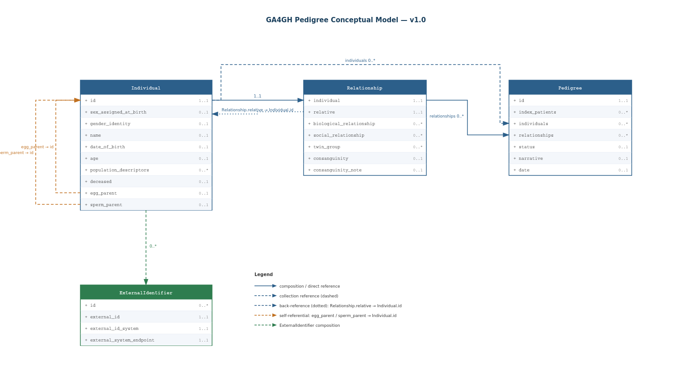

########################
Conceptual Model
########################

.. toctree::
   :maxdepth: 1

Overview
========

To support the interoperability of family health history data within and between existing standards (such as HL7 FHIR and Phenopackets), the GA4GH Clinical and Phenotypic Data Capture Workstream developed the Pedigree Conceptual Model.

The Pedigree Conceptual Model defines core concepts and their properties, and is based on `A Recommendation for The Common Data Set for Family Health History <https://docs.google.com/document/d/1GQRd5jeZeB5qhHclLZxDe6kPD173bXWGYlTsmCbTeuI/edit>`_.

Concepts
========

The diagram below shows an overview of the pedigree concepts. Lines between concepts indicate composition.

Individual
----------

The **Individual** concept represents an individual person or patient who is a member of the pedigree being investigated.

.. list-table::
   :header-rows: 1

   * - Field
     - Multiplicity
     - Description
   * - id
     - 1..1
     - Pedigree internal identifier for the individual
   * - sex_assigned_at_birth
     - 0..1
     - Sex assigned at birth. Recommended values: ``assigned male``, ``assigned female``, ``not assigned at birth``.
   * - gender_identity
     - 0..1
     - Presumed or reported gender identity (if known). Recommended values: ``man``, ``woman``, ``nonbinary/gender diverse/gender expansive``, ``other``.
   * - name
     - 0..1
     - Name of the individual
   * - date_of_birth
     - 0..1
     - Birth date of the individual, can be just birth year in most cases
   * - age
     - 0..1
     - Age of the individual, can be either Age, Estimated Age (or Ontology Class), Age Range, and/or Gestational Age; See also `Phenopackets' TimeElement <https://phenopacket-schema.readthedocs.io/en/latest/time-element.html#rsttimeelement>`_.
   * - population_descriptors
     - 0..*
     - Information about the individual's ancestry, ethnicity, race, tribe, etc.; terms from the `Human Ancestry Ontology (HANCESTRO) <https://www.ebi.ac.uk/ols/ontologies/hancestro>`_ are recommended, but freetext must be supported
   * - deceased
     - 0..1
     - The presumed/accepted life status of the individual as of the pedigree collection date
   * - egg_parent
     - 0..1
     - Identifier of the individual who provided the egg (genetic maternal parent); should be consistent with the biological relationship tree
   * - sperm_parent
     - 0..1
     - Identifier of the individual who provided the sperm (genetic paternal parent); should be consistent with the biological relationship tree

.. note::

   **Removed from v0.1:**

   - ``karyotypicSex`` — chromosomal sex is now expected to be represented in linked genotypic data.
   - ``affected`` — affected status is now expected to be represented in linked phenotypic data (e.g., a Phenopacket).

ExternalIdentifier
------------------

The **ExternalIdentifier** concept links an ``Individual`` to their identifier(s) in one or more external systems (e.g., an EHR or a Phenopacket store). An individual may have zero or more external identifiers.

.. list-table::
   :header-rows: 1

   * - Field
     - Multiplicity
     - Description
   * - id
     - *..0
     - Pedigree internal identifier of the ``Individual`` this record belongs to (foreign key)
   * - external_id
     - 1..1
     - The identifier for the individual within the external system (e.g., a patient MRN or Phenopacket ID)
   * - external_id_system
     - 1..1
     - The system or namespace that assigns the external identifier (e.g., ``https://hl7.org/fhir/R4/``, ``https://github.com/ga4gh/phenopacket-schema``)
   * - external_system_endpoint
     - 1..1
     - The base endpoint URL of the external system where the record can be retrieved (e.g., ``https://fhir.epic.com/interconnect-fhir-oauth/api/FHIR/R4/``)

Relationship
------------

The *Relationship* concept represents the relationship that one individual has to another individual. The single ``relation`` field from v0.1 has been replaced by separate ``biological_relationship`` and ``social_relationship`` fields to allow independent, multi-valued representation of each relationship type.

.. list-table::
   :header-rows: 1

   * - Field
     - Multiplicity
     - Description
   * - individual
     - 1..1
     - Identifier of the subject ``Individual``; equivalent to the Biolink "subject"
   * - relative
     - 1..1
     - Identifier of the relative ``Individual``; equivalent to the Biolink "object"
   * - biological_relationship
     - 0..*
     - One or more biological relationships from the KIN biological subset (e.g., ``isBiologicalMotherOf`` [egg + gestation], ``isBiologicalFatherOf`` [sperm], ``isGestationalCarrierOf``, ``isOvumDonorOf``, ``isSpermDonorOf``). Should be consistent with ``egg_parent`` / ``sperm_parent`` fields on ``Individual``.
   * - social_relationship
     - 0..*
     - One or more social/legal relationships from the KIN social subset (e.g., ``isAdoptiveParentOf``, ``isFosterParentOf``, ``isStepParentOf``). See the `KIN Ontology <http://purl.org/ga4gh/kin.owl>`_.
   * - twin_group
     - 0..*
     - Twinning relationship type, if applicable. Recommended values: ``monozygotic``, ``dizygotic``.
   * - consanguinity
     - 0..1
     - Whether a consanguineous relationship exists between the two individuals (``true`` / ``false``)
   * - consanguinity_note
     - 0..1
     - Free-text note providing additional detail about the consanguineous relationship

.. note::

   **Removed from v0.1:**

   - ``relation`` — replaced by the combination of ``biological_relationship`` and ``social_relationship`` to allow separate, multi-valued representation of biological and social/legal relationship types.

Pedigree
--------

A **Pedigree** is a set of individuals and the relationships between them.

.. list-table::
   :header-rows: 1

   * - Field
     - Multiplicity
     - Description
   * - id
     - 1..1
     - External identifier for the family being investigated
   * - index_patients
     - 0..*
     - Identified ``Individual`` in the family of a health condition of focus being investigated: ``Proband``, ``Consultand``, ``First Person Tested Positive``
   * - individuals
     - 0..*
     - Collection of ``Individual`` who are the members of this pedigree
   * - relationships
     - 0..*
     - Collection of ``Relationship`` between the ``individuals`` who are the members of this pedigree
   * - status
     - 0..1
     - Status of the pedigree resource collection
   * - narrative
     - 0..1
     - Summary of the pedigree resource for human interpretation
   * - date
     - 0..1
     - The date the pedigree was collected or last updated, as ISO full or partial date, *i.e.* ``YYYY``, ``YYYY-MM``, or ``YYYY-MM-DD``

Design motivations
==================

Design motivation:

- avoid overlap with other standards (fhir, phenopacket)
- focus on relationship
- graphical model, bringing relationships as top-level entities
- allow for the synthesizing of patient-reported family history data, such as comes out of family history questionnaires and EHR records (and can be represented with the FamilyMemberHistoryResource), and support this information through to risk models
- provide a standard interface for validation
- facilitate conversion among existing standards for pedigree data

Relationships between individuals are standardized using concepts from the newly developed Kinship Ontology.
To allow existing workflows and tools to gracefully add interoperability with this standard, we developed an open-source pedigree data interoperability library, pedigree-tools.
